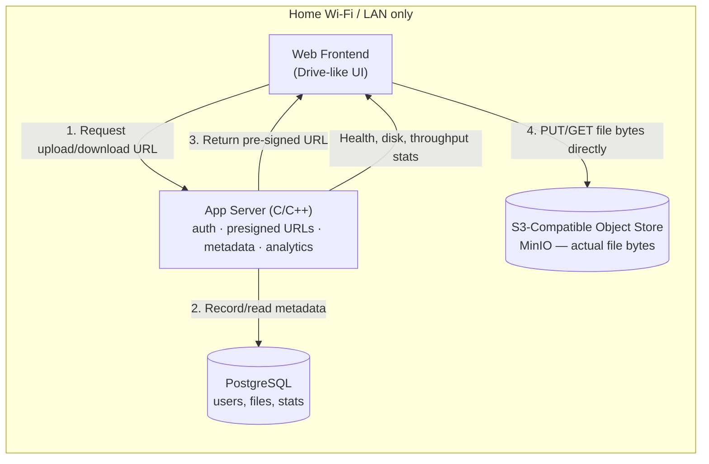

# HomeServerUpload
<p align="center">


</p>
A self-hosted, LAN-only file storage service — think "Google Drive for your home network" — built from scratch in **C and C++** as a hands-on systems programming project.

You get a fast, private drop box for your own devices: pick a file, get a pre-signed upload link, push bytes straight to object storage, and see it show up instantly in a Drive-like web UI. No cloud, no accounts outside your house, no bill.

---

## Why this project exists

This isn't just a file server — it's a vehicle for learning C and C++ by building something real. Every subsystem below doubles as a lesson:

| Building this...                          | Teaches you...                                             |
|--------------------------------------------|--------------------------------------------------------------|
| The HTTP listener                          | Raw sockets, `epoll`/`select`, non-blocking I/O               |
| Pre-signed URL generation                  | HMAC-SHA256 signing, `OpenSSL`, string/buffer safety           |
| PostgreSQL metadata layer                  | `libpq`, prepared statements, connection pooling in C++       |
| The storage backend client                 | Streaming HTTP requests, chunked transfer, error handling     |
| The analytics collector                    | `/proc` and `statvfs` for disk stats, atomic counters, threading |
| Memory management throughout               | Manual allocation in C, RAII/smart pointers in C++, avoiding leaks & UAF |

Because of this, the codebase is **heavily commented on purpose** — every non-trivial function explains *why*, not just what, so it doubles as a learning trail. Expect comments that call out ownership rules, lifetime assumptions, and gotchas specific to C/C++ rather than restating the obvious.

---

## How it works



The key idea behind pre-signed URLs: the app server never touches raw file bytes. It just proves "yes, this request is allowed" by handing out a short-lived, cryptographically signed URL. The browser then talks **directly** to the object store for the actual transfer. This keeps the C/C++ server lightweight and is exactly how AWS S3 clients work in production.

### Upload flow
1. Frontend asks the server: "I want to upload `vacation.mp4`, 240MB, video/mp4."
2. Server checks the request came from the local subnet, generates a signed, time-limited **PUT** URL pointing at the object store, and inserts a `pending` row into PostgreSQL (`user_id`, `filename`, `size`, `filetype`, `timestamp`).
3. Frontend uploads the file bytes straight to the object store using that URL.
4. Object store confirms completion → server flips the row to `complete` and the file shows up in the UI.

### Download flow
Mirror image: server validates the requester is on the LAN and owns/can-see the file, mints a signed **GET** URL, frontend fetches the bytes directly from storage.

---

## Local-network-only by design

This service is intentionally **not** exposed to the internet:

- The server binds only to the host's LAN-facing IPv4 interface (never `0.0.0.0` on a public NIC).
- Every request is checked against the server's own subnet (RFC 1918 ranges: `192.168.0.0/16`, `10.0.0.0/8`, `172.16.0.0/12`) — anything outside it is rejected before it reaches application logic.
- No port forwarding, no reverse proxy to the WAN, no external auth provider. If you're not on the Wi-Fi, you don't exist to this server.

---

## Tech stack

| Layer               | Choice                                   | Notes |
|---------------------|-------------------------------------------|-------|
| App server           | **C / C++**                              | Core learning focus of the project |
| Object storage        | **MinIO** (S3-compatible, self-hosted)   | Speaks the real S3 API — presigned URLs, multipart uploads |
| Metadata database      | **PostgreSQL** via `libpq`             | `user_id`, `timestamp`, `size`, `filetype`, storage key, status |
| Frontend              | Lightweight web app (HTML/CSS/JS)         | Google Drive–style grid/list view, drag-and-drop |
| Crypto/signing        | `OpenSSL` (HMAC-SHA256)                 | Presigned URL generation & validation |
| Metrics/analytics     | Custom collector (`statvfs`, `/proc`)   | Disk health, throughput, request stats |

---

## Feature set

**Core**
- Drag-and-drop upload and one-click download, backed by pre-signed URLs
- File metadata tracked per user: owner, size, filetype, upload timestamp
- Strictly LAN-scoped access — no external exposure

**Frontend**
- Google Drive–inspired grid/list browser
- Upload progress, file previews/icons by type, search and sort
- Simple, uncluttered — built for a handful of household users, not a SaaS product

**Analytics dashboard**
- Storage health: total/used/free disk space, growth trend over time
- Live upload/download throughput (MB/s) per transfer and aggregate
- Historical charts for transfer speeds and storage usage
- Basic server health (uptime, active connections, error rates)

---

## Project structure (planned)

```
HomeServerUpload/
├── server/              # C/C++ application server
│   ├── src/
│   │   ├── net/         # socket handling, event loop
│   │   ├── auth/        # LAN-restriction + user checks
│   │   ├── presign/     # HMAC signing for upload/download URLs
│   │   ├── db/          # PostgreSQL access layer (libpq wrapper)
│   │   ├── storage/     # MinIO/S3 client (multipart, presign requests)
│   │   └── metrics/     # disk + throughput collectors
│   └── include/
├── frontend/            # Drive-like web UI + analytics dashboard
├── db/
│   └── migrations/      # PostgreSQL schema (users, files, transfer_stats)
├── infra/               # MinIO + PostgreSQL local setup (docker-compose)
└── README.md
```

---

## Status

Early design stage — this README describes the target architecture. Implementation is in progress, one subsystem at a time, starting with the networking layer.

## License

Personal home project — license TBD.
